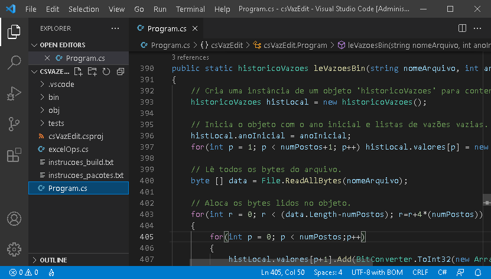
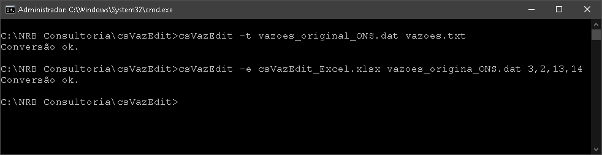

# csVazEdit versão 0.001
Código em C# para ler e escrever arquivos binários de vazão utilizados nos modelos Newave, Decomp, Gevazp e Dessem.


 
 
 

Modelo de arquivo Excel que o pyVazEdit lê para atualizar um arquivo de vazões binários:

 


## Utilização:

Para utilizar o csVazEdit, existem duas formas básicas:

### A) Alterando o código-fonte e utlizando as funções básicas:

#### A.1) Importando os dados de vazão de um arquivo binário:
```C#

var meuHistorico = leVazoesBin(<caminho completo do arquivo binário>); 

```

#### A.2) Importando os dados de vazão de um arquivo texto (formato VazEdit):
```C#

var meuHistorico = leVazoesTxt(<caminho completo do arquivo binário>);

```

#### A.3) Alterando ou incluindo valores em um histórico de vazões lido:
```C#

mudaVazao(meuHistorico,1,2,1931,999);

```

#### A.4) Salvando um histórico de vazões lidos em um formato específico:
```C#

 salvaVazoes(meuHistorico, <caminho completo para o arquivo de saída>, "binario");     // formato binário
 salvaVazoes(meuHistorico, <caminho completo para o arquivo de saída>, "csv");         // formato texto csv
 salvaVazoes(meuHistorico, <caminho completo para o arquivo de saída>, "vazEdit");     // formato texto VazEdit     

```

### B) Utilizando a linha de comando para invocar uma das funções já criadas:

#### B.1) Convertendo um arquivo binário para texto:
```C#
csVazEdit -b <caminho do arquivo binário de entrada> <caminho do arquivo texto de saída> [ano inicial] [número de postos] 
````
ano incial - argumento opcional para especificar o primeiro ano do histórico do arquivo binário. Utilize este parâmetro caso o arquivo binário tenha um ano inicial diferente de 1931;

número de postos - argumento opcional para especificar o número de postos do arquivo binário a ser convertido. O ONS utiliza 320 postos para o modo "operação" do sistema e 600 postos para o modo "planejamento".

#### B.2) Convertendo um arquivo texto para binario:
```C#
csVazEdit -t <caminho do arquivo texto de entrada> <caminho do arquivo binário de saída>

```

#### B.3) Atualizando um arquivo binário com dados lidos de um arquivo Excel (requer o pacote EEPlus):
```C#
csVazEdit -e <caminho do arquivo Excel de entrada> <caminhgo do arquivo binário de saída> <intervalo Excel>

```
<intervalo Excel> devem ser quatro valores separados por vírgulos. São eles: linIni, colIni, linFim e colFim. Onde:
  linIni, colIni  - linha e coluna da primeira célula (canto superior esquerdo) da tabela de dados a serem lidos;
  linFim, colFim  - linha e coluna da última célula (canto inferior direito) da tabela de dados a serem lidos.
 
Exemplo:
```C#
csVazEdit -e excel.xlsx vazoes.bin 3,2,13,14

```
  

## Dependências:

EEPlus

## Licença:

[Ver licença](LICENSE)


## Projeto relacionado:

[NVazEdit C#](http://nrbenergia.somee.com/SoftDev/NVazEdit/NVazEdit)


## Sobre o autor:

[Meu LinkedIn](http://www.linkedin.com/in/nelsonrossibittencourt)

[Minha página de projetos](http://www.nrbenergia.somee.com)
