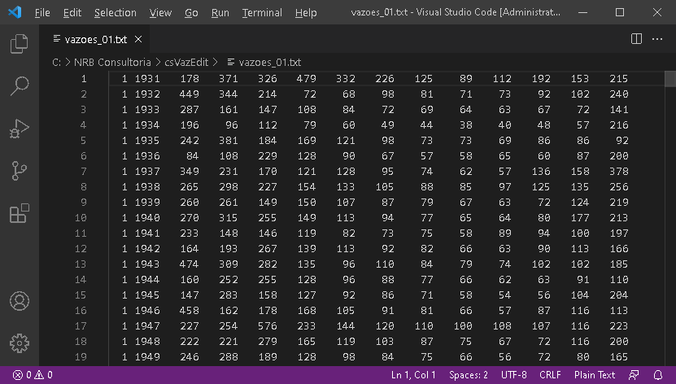

# csVazEdit versão 0.003

O csVazEdit é um aplicativo para converter arquivos binários de vazões, postos e MLTs em formato texto e vice-versa. Além de reproduzir as funções do aplicativo original 'VazEdit' do ONS, o csVazEdit também poderá estendê-las.

Os arquivos de vazões, MLTs e postos são utilizados pelo ONS e CCEE nos modelos Newave, Decomp, Gevazp e Dessem.


 

 

Modelo de arquivo Excel que o pyVazEdit lê para atualizar um arquivo de vazões binários:

 


## Utilização:

Para utilizar o csVazEdit, existem duas formas básicas:

### A) Alterando o código-fonte e utlizando as funções básicas:

#### A.1) Importando os dados de vazão de um arquivo binário:
```C#

var meuHistorico = fileOps.loadBinVazoes(<caminho completo do arquivo binário>, [anoInicial],[numPostos]); 

```

#### A.2) Importando os dados de vazão de um arquivo texto (formato VazEdit):
```C#

var meuHistorico = fileOps.loadTxtVazoes(<caminho completo do arquivo texto>);

```

#### A.3) Alterando ou incluindo valores em um histórico de vazões lido:
```C#

mudaVazao(meuHistorico,1,2,1931,999);

```

#### A.4) Salvando um histórico de vazões lidos em um formato específico:
```C#

 fileOps.saveVazoes(meuHistorico, <caminho do arquivo de saída>, "binario");     // formato binário
 fileOps.saveVazoes(meuHistorico, <caminho do arquivo de saída>, "csv");         // formato texto csv
 fileOps.saveVazoes(meuHistorico, <caminho do arquivo de saída>, "vazEdit");     // formato texto VazEdit     

```
### A.5) Importanto dados de um arquivo binário de MLTs:
```C#

var minhasMLTs = fileOps.loadBinMLTs(<caminho do arquivo de entrada> , [numPostos]);

```
### A.6) Importanto dados de um arquivo texto de MLTs:
```C#

var minhasMLTs = fileOps.loadTxtMLTs(<caminho do arquivo de entrada>);

```

### A.7) Salvando dados de MLTs para os formatos binário e/ou 'VazEdit':
```C#

fileOps.saveMLTs(<caminho do arquivo de saída>, minhasMLTs, "binario");  // formato binário
fileOps.saveMLTs(<caminho do arquivo de saída>, minhasMLTs, "vazEdit");  // formato texto 'VazEdit'

```

### A.7) Importanto dados de um arquivo binário de postos:
```C#

var meusPostos = fileOps.loadBinPostos(<caminho do arquivo de entrada>,[numPostos]);

```

### A.8) Importanto dados de um arquivo texto de postos:
```C#

var meusPostos = fileOps.loadTxtPostos(<caminho do arquivo de entrada>,[numPostos]);

```


### A.8) Salvando dados de postos para os formatos binário e/ou 'VazEdit':
```C#

fileOps.savePostos(<caminho do arquivo de saída>, meusPostos, "binario");  // formato binário
fileOps.savePostos(<caminho do arquivo de saída>, meusPostos, "vazEdit");  // formato texto 'VazEdit'            

```

### B) Utilizando a linha de comando para invocar uma das funções já criadas:

### B.1) Dados de vazões:

##### B.1.1) Convertendo um arquivo binário de vazões para texto:
```C#

csVazEdit vazoes -paraTexto <caminho do arquivo binário de entrada> <caminho do arquivo texto de saída> [-ai <ano inicial>] [-np <número de postos>] 

```
-ai <ano inicial> - argumento opcional para especificar o primeiro ano do histórico do arquivo binário. Utilize este parâmetro caso o arquivo binário tenha um ano inicial diferente de 1931;

-np <número de postos> - argumento opcional para especificar o número de postos do arquivo binário a ser convertido. O ONS utiliza 320 postos para o modo "operação" do sistema e 600 postos para o modo "planejamento".
 
##### B.1.2) Convertendo um arquivo binário de vazões para csv:
```C#

csVazEdit vazoes -paraCSV <caminho do arquivo binário de entrada> <caminho do arquivo texto de saída> [-ai <ano inicial>] [-np <número de postos>] 

```
-ai <ano incial> - argumento opcional para especificar o primeiro ano do histórico do arquivo binário. Utilize este parâmetro caso o arquivo binário tenha um ano inicial diferente de 1931;

-np <número de postos> - argumento opcional para especificar o número de postos do arquivo binário a ser convertido. O ONS utiliza 320 postos para o modo "operação" do sistema e 600 postos para o modo "planejamento".
 
##### B.1.3) Convertendo um arquivo texto de vazões para binario:
```C#

csVazEdit vazoes -paraBinario <caminho do arquivo texto de entrada> <caminho do arquivo binário de saída> [-ai <ano inicial>] [-np <número de postos>]

```

##### B.1.4) Atualizando um arquivo binário de vazões com dados lidos de um arquivo Excel (requer o pacote EEPlus):
```C#

csVazEdit vazoes -atualizaBinario <caminho do arquivo binário de entrada> <caminhgo do arquivo binário de saída> <arquivo Excel padrão> -ex <intervalo Excel>

```
-ex <intervalo Excel> deve ser uma string com quatro valores separados por vírgulos. São eles devem ter o seguinte formato: "linIni, colIni, linFim e colFim" . Onde:
  linIni, colIni  - linha e coluna da primeira célula (canto superior esquerdo) da tabela de dados a serem lidos;
  linFim, colFim  - linha e coluna da última célula (canto inferior direito) da tabela de dados a serem lidos.
 
Exemplo:
```C#

csVazEdit vazoes -atualizaBinario tests/vazoes.dat tests/vazoes_atualizadas.dat tests/csVazEdit_Excel.xlsx vazoes.bin 3,2,13,14

```

### B.2) Dados de MLTs:

##### B.2.1) Convertendo um arquivo binário de MLTs para arquivo texto:
```C#

csVazEdit mlts -paraTexto <arquivo binário de MLTs de entrada> <arquivo texto de MLTS de saída> -np <número de postos>

```
 
##### B.2.2) Convertendo um arquivo texto de MLTs para arquivo binário:
```C#

csVazEdit mlts -paraBinario <arquivo texto de MLTs de entrada> <arquivo binário de MLTS de saída> -np <número de postos>

```

### B.3) Dados de postos:

##### B.3.1) Convertendo um arquivo binário de postos para arquivo texto:
```C#

csVazEdit postos -paraTexto <arquivo binário de postos de entrada> <arquivo texto de postos de saída> -np <número de postos>

```
 
##### B.3.2) Convertendo um arquivo texto de postos para arquivo binário:
```C#

csVazEdit postos -paraBinario <arquivo texto de postos de entrada> <arquivo binário de postos de saída> -np <número de postos>

```
 

## Dependências:

[EEPlus](https://www.nuget.org/packages/EPPlus)

## Licença:

[Ver licença](LICENSE)

## Projeto relacionado:

[NVazEdit C#](http://nrbenergia.somee.com/SoftDev/NVazEdit/NVazEdit)

## Sobre o autor:

[Meu LinkedIn](http://www.linkedin.com/in/nelsonrossibittencourt)

[Minha página de projetos](http://www.nrbenergia.somee.com)
